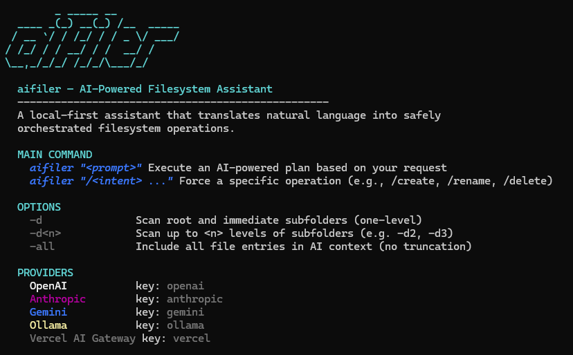

<div align="center">

# aifiler

An AI-powered local filesystem assistant. Instead of manual sorting and naming, simply describe your intent and let `aifiler` handle the planning, approval, and execution.

[](https://go.dev/)
[](#quick-start)
[](https://opensource.org/licenses/MIT)

</div>

## Preview



---

## ✨ Key Features

* 🧠 **Dynamic Planning**: Translates natural language into structured filesystem operations.
* 🗂️ **Context Awareness**: Intelligently scans your workspace to provide relevant suggestions.
* ✅ **Safety First**: Every action is staged for your approval before execution.
* 🔌 **Provider Agnostic**: Supports OpenAI, Anthropic, Gemini, Ollama, and Vercel AI Gateway.
* 🎨 **Modern CLI**: Clean, professional output with interactive arrow-key menus and colorful progress feedback.
* ⏪ **One-Click Undo**: Accidentally applied a plan? Revert changes instantly with the `undo` command.
* 💬 **Clean Output**: Optimized for fast, readable, plain-text AI interactions without markdown clutter.

---

## 🚀 Usage

Run `aifiler` followed by your request in quotes. By default, it scans only the **root directory** for context.

```bash
aifiler "organize my images into folders by year"
```

## Quick Start

Download the latest binary from [releases](https://github.com/joshiminh/aifiler/releases) or clone the repository and build it manually.

### Windows

```batch
run.bat
```

### macOS / Linux

```bash
go mod tidy
go build -o aifiler ./cmd/aifiler
./aifiler
```

---

Supported providers (in order of preference):

| Provider | Key | Notes |
| :--- | :--- | :--- |
| OpenAI | `openai` | Open AI GPT models via their API |
| Anthropic | `anthropic` | Claude 3.x family via their API |
| Gemini | `gemini` | Google Gemini models via their API |
| Ollama | `ollama` | Local models via Ollama |
| Vercel AI Gateway (recommended) | `vercel` | Routes to multiple providers |

---

## 🤝 Contributing

Contributions are welcome! If you find a bug or have a feature request, please open an issue or submit a Pull Request.

## 📄 License

This project is licensed under the MIT License - see the [LICENSE](LICENSE) file for details.
